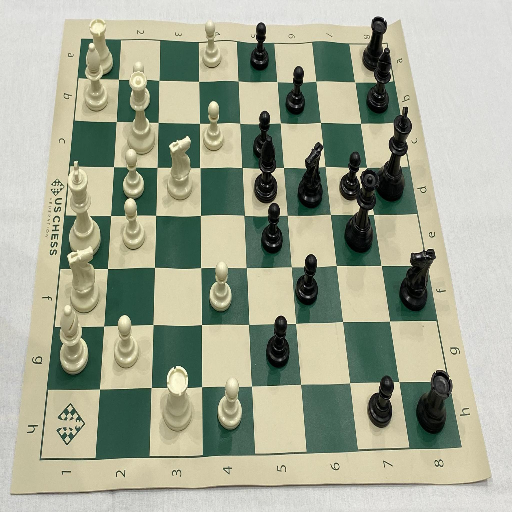
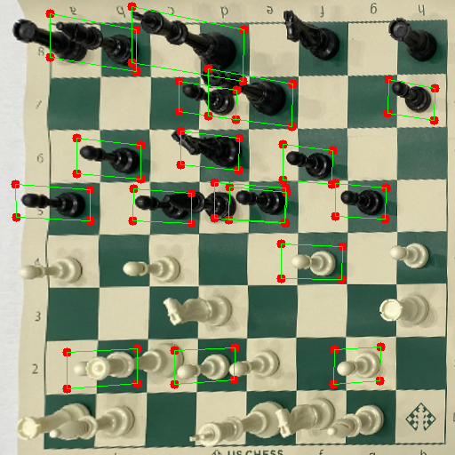
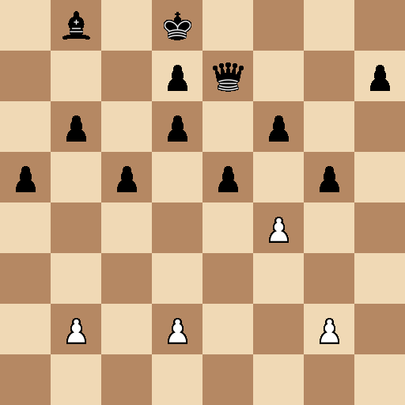

# 3D-chessboard-and-piece-recognition

Detects a real chessboard on digital image, classifies each piece, visualizes the state of the board in a standard 2D format. 

Project for the image processing course.

** See the [report](doc/Aron_Katona_Andrada_Petcu_-_3D_Chessboard_and_piece_recognition.pdf) **

## Contributors

- Aron Katona
- Andrada Petcu

## Results

### Input image

### Image after perspective projection and piece classification

### Visualization of the state of the board

## Acknowledgements

- dataset: https://public.roboflow.com/object-detection/chess-full/24
- notebook used for training: https://colab.research.google.com/drive/1U3fkRu6-hwjk7wWIpg-iylL2u5T9t7rr
- dataset: https://github.com/opencv/opencv/tree/4.5.2/samples/data
- visualization images: https://lichess.org/

